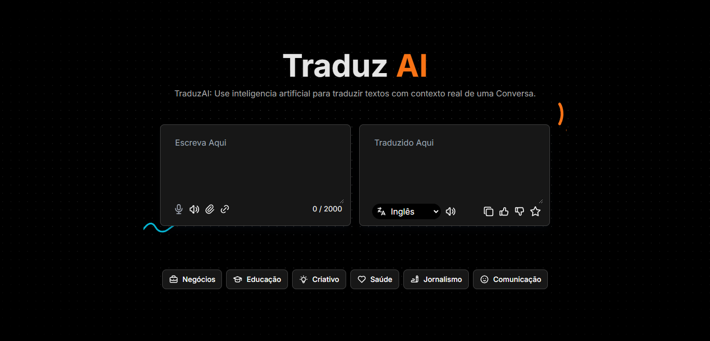

<div align="center">
  <br />
      
  
  <br />

  <div>
    
    
    
    
  </div>

  <h3 align="center">Traduz AI</h3>

</div>

## <a name="introduction">🤖 Introducão</a>
Desenvolvido com as mais recentes tecnologias Next.js e TypeScript, o LinguaSpeak é uma ferramenta avançada de tradução por voz. Ele permite que os usuários falem no microfone, traduzam o texto falado para outro idioma e reproduzam a tradução. Este projeto é perfeito para quem usa AI para traduzir textos com contexto real de uma conversa.

## <a name="tech-stack">⚙️ Tech Stack</a>

- Next.js
- TypeScript
- Gemini API
- React Speech Recognition
- Tailwind CSS

## <a name="features">🔋 Funcionalidades</a>

👉 **Reconhecimento de Voz:** Converte palavras faladas em texto usando a API Web Speech.

👉 **Tradução de Texto:** Traduz o texto reconhecido para um idioma de destino selecionado usando o modelo Gemini 1.5 da Google.

👉 **Reproduzir Áudio:** Converte o texto traduzido de volta para fala usando a síntese de voz da API Web Speech.

👉 **Busca de Conteúdo em Links:** Busca e traduz o conteúdo de texto de URLs fornecidas.

👉 **Seleção de Idioma:** Permite que os usuários selecionem os idiomas de destino para tradução.

👉 **Copiar para Área de Transferência:** Copia o texto traduzido para a área de transferência.

👉 **Curtir, Descurtir e Favoritar:** Oferece recursos de interação do usuário para traduções.

👉 **Design Responsivo**: Garante uma experiência perfeita em diferentes dispositivos.

**Cloning the Repository**

```bash
git clone https://github.com/gildairmoreira/traduz-ai.git
cd traduz-ai
```

**Installation**

Install the project dependencies using npm:

```bash
npm install
```

**Set Up Environment Variables**

Create a new file named `.env` in the root of your project and add the following content:

```env
NEXT_PUBLIC_API_KEY=your-api-key
```

**Running the Project**

```bash
npm run dev
```

Open [http://localhost:3000](http://localhost:3000) in your browser to view the project.
